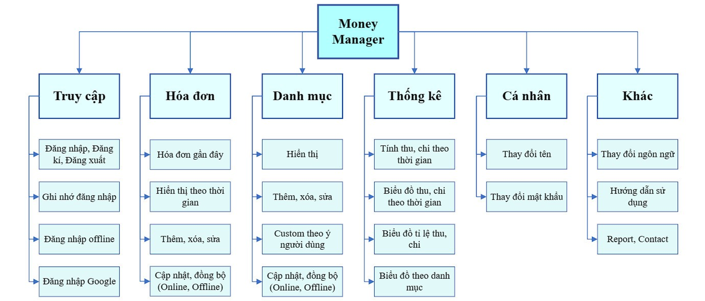
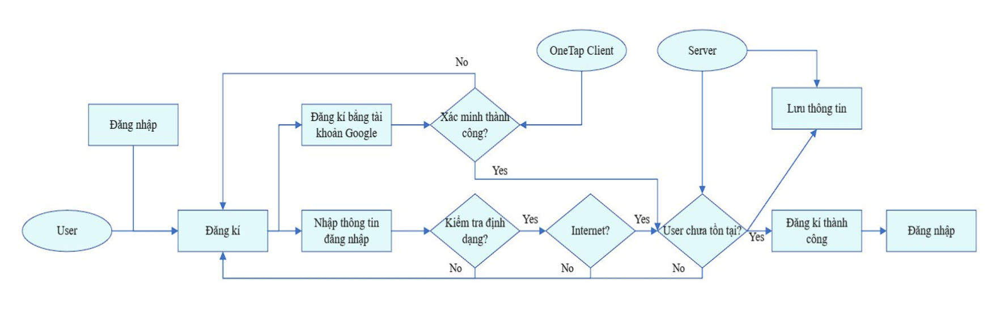
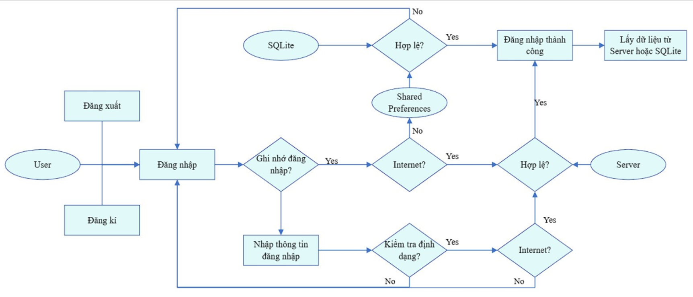
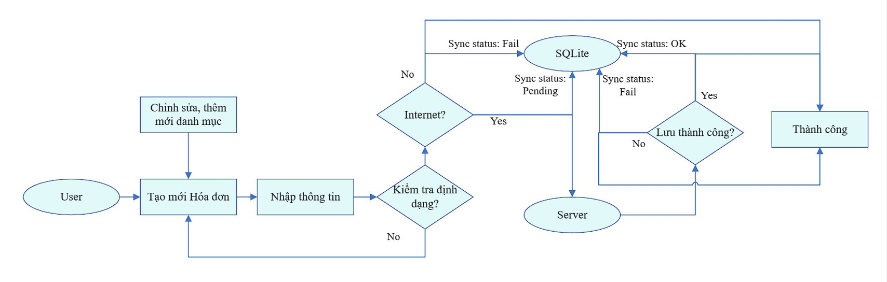
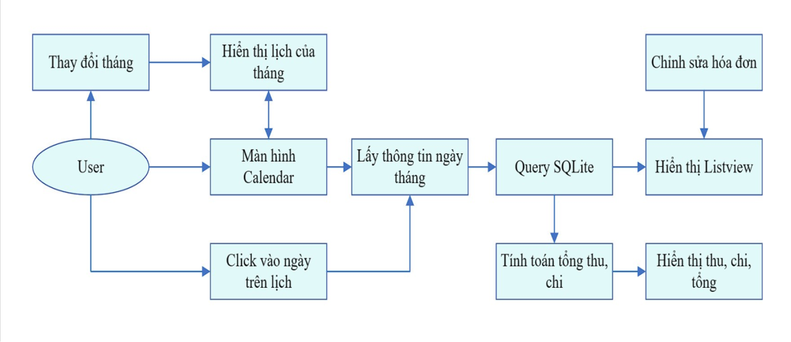
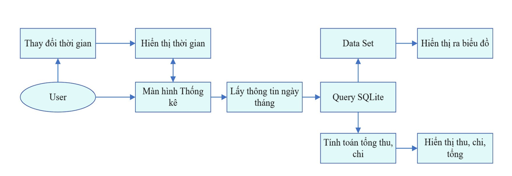

# Money Management App

## Overview
This project is an Android application for managing personal expenses, developed by Group 3 of the NT118 class under the guidance of Mrs.Trần Hồng Nghi.

## Project Objectives
- Develop a practical mobile application to address real-world expense management issues
- Gain a deeper understanding of the Android app development process using Android Studio
- Provide users with tools to record and analyze expenses, including reports and financial charts
- Support users in budget planning and personal finance management

## Technologies Used
- **Java**: Programming language
- **Android Studio**: Integrated Development Environment (IDE)
- **MySQL**: Database management system
- **Figma**: User interface design tool
- **GitHub**: Source code management

## Key Features
1. Add and edit invoices
2. Manage expense categories
3. Generate statistics and reports
4. Push notifications
5. User profile management
6. In-app instructions
7. Language settings
8. User feedback reporting
9. Offline functionality

## Functional Decomposition

## Flowchart
### 1. Login

### 2. Sign up

### 3. Add invoices

### 4. Show invoices

### 5. Chart

### Application images

[Apllicaiton images](design-in-app/)

## Challenges
- Optimizing app resource usage
- Limitations in Gmail login functionality

## Future Developments
- Optimize app resource usage
- Enhance Gmail login functionality
- Implement AI for expense planning features

## Acknowledgements
Special thanks to our instructor, Trần Hồng Nghi, for guidance throughout the project.

---

For more detailed information about the project, please refer to the full project report.